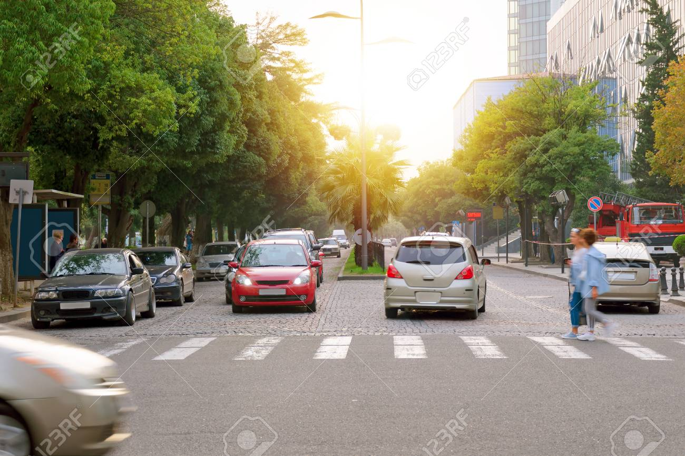
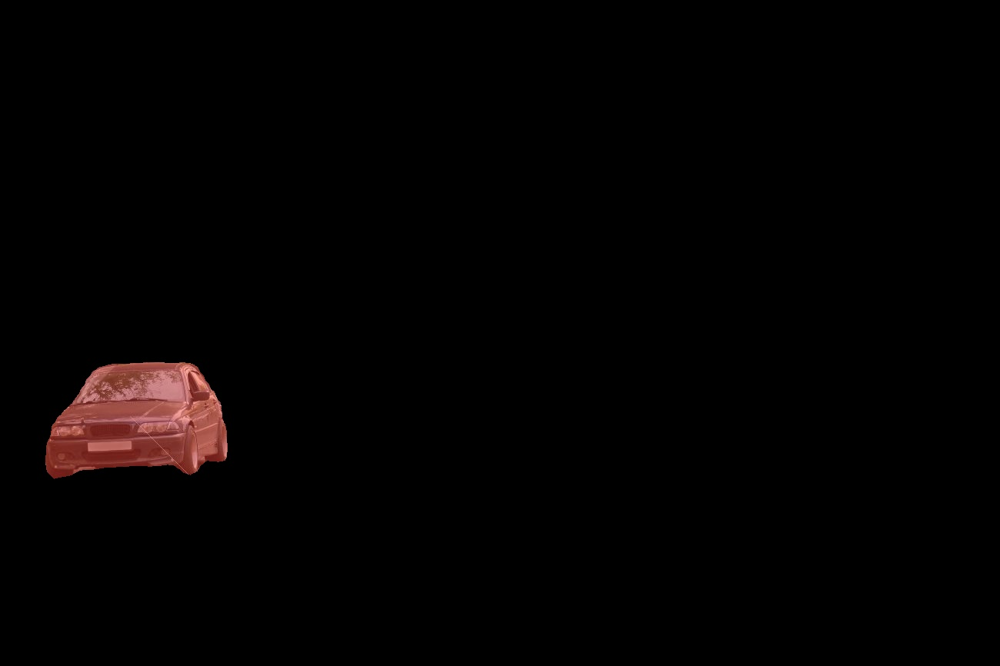
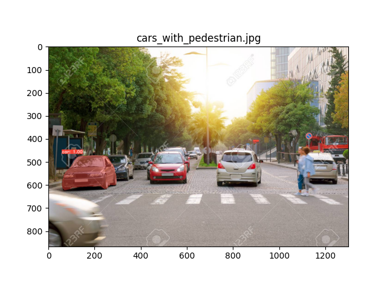
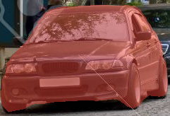
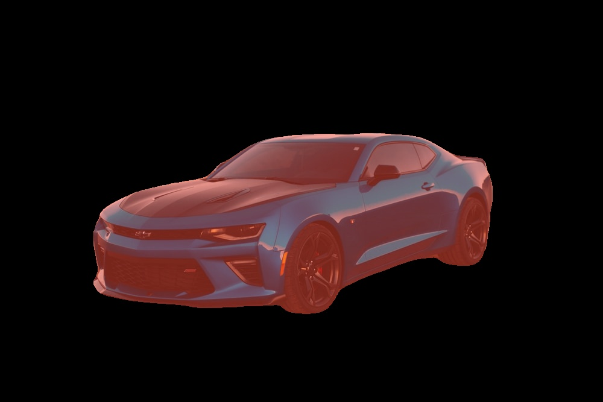
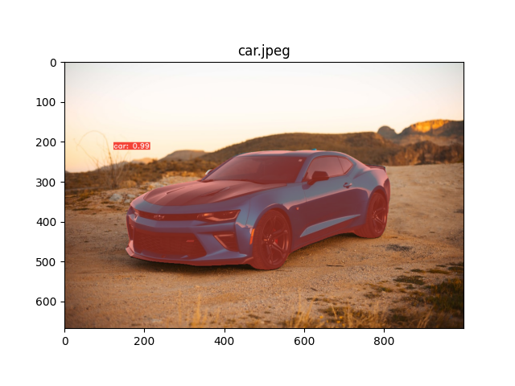
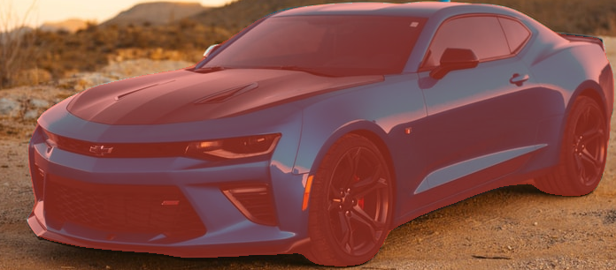

# yolact

 This is the code from the papers: - [YOLACT: Real-time Instance Segmentation](https://arxiv.org/abs/1904.02689)
 
 I have used and updated the code from https://github.com/dbolya/yolact.git


This repo will help you detect and segment the instances of the cars: 


# Installation
 - Clone this repository and enter it:
   ```Shell
   git clone https://github.com/Priyashbhugra/yolact.git
   cd yolact
   ```
 - Create Anaconda environment:

   ```Shell
   conda create -n yolact 
  
      ```
 - Run the below command and wait untill the envionment is created:


   ```Shell
   conda create -n yolact
   conda activate yolact
   ```
 - Run the below command and wait untill the envionment is created:
   ```Shell
   conda env create -f environment.yml
   ```


# Evaluation
Here is a YOLACT model pretrained on COCO dataset:


- Download Resnet101-FPN ----------[yolact_im700_54_800000.pth](https://drive.google.com/file/d/1lE4Lz5p25teiXV-6HdTiOJSnS7u7GBzg/view?usp=sharing)

I am only using Resnet101-FPN as a backbone.
To evalute the model, put the corresponding weights file in the `weights` directory and run one of the following commands.

## Results on pretrained COCO dataset
- Run the below command for evaluation
- I have made some changes to eval.py file for some more arguments like  --display_best_bboxes_only=True , --display_object_without_mask=True  required for the second AI task.
```Shell
python eval.py --trained_model=weights/yolact_im700_54_800000.pth --score_threshold=0.15 --image=car.jpeg --cross_class_nms=True --display_best_bboxes_only=True --display_bboxes=False --display_best_masks_only=True --top_k=1 --display_object_without_mask=True 
```


Here we tried to detect and genarate a mask for all the cars in an image. Below you can see the results from this YOLACT model. This repo supports FPN.

- As asked in the task Example 1:
- Only the highest score car is detected and a mask is generated over the car:
 

- Masked Image of the car with highest confidence score 



 



Another example for car as asked in the task 


- Masked Image of the car with highest confidence score


 



If you want to detect and segment all the cars in an image use the below code.
```Shell
python eval.py --trained_model=weights/yolact_im700_54_800000.pth --score_threshold=0.15 --image=car.jpeg --cross_class_nms=True 
```


