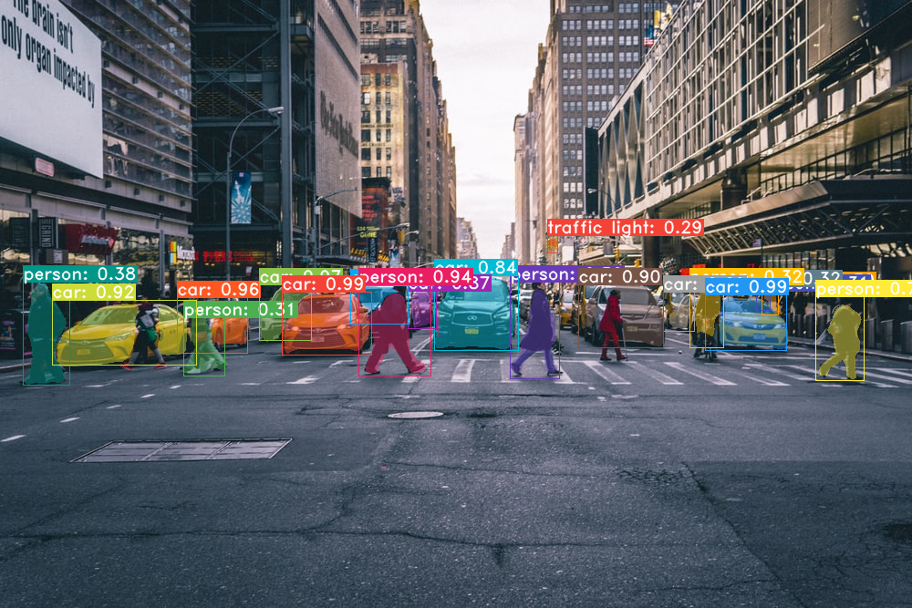
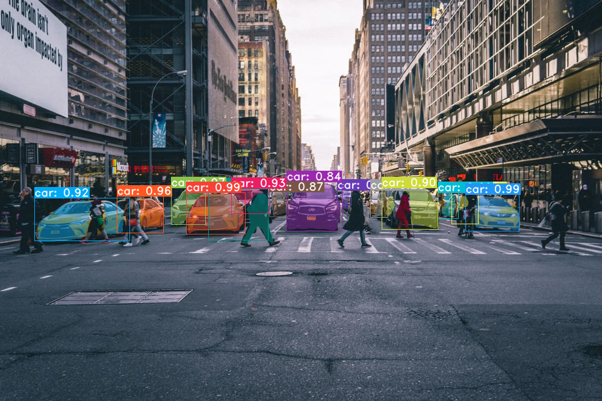
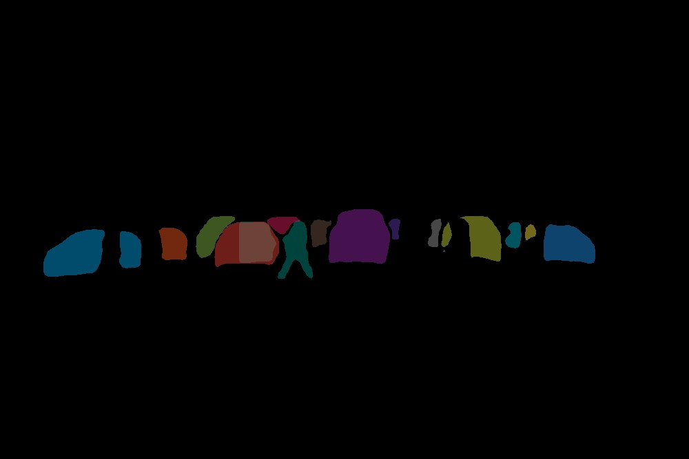
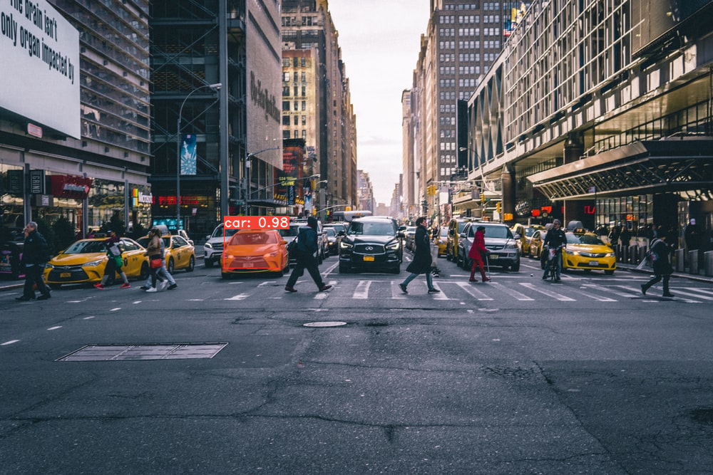
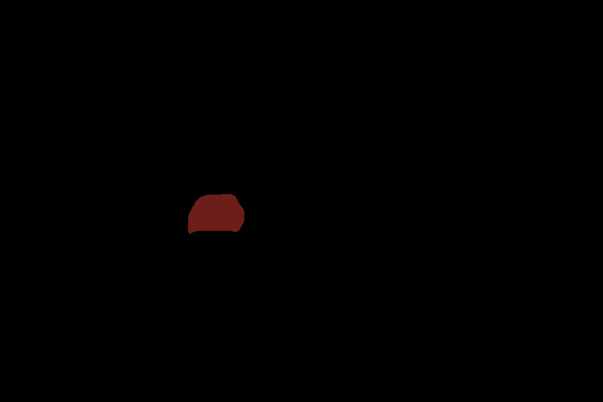
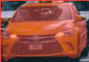

# yolact

 This is the code from the papers: - [YOLACT: Real-time Instance Segmentation](https://arxiv.org/abs/1904.02689)
 
 I have used and updated the code from https://github.com/dbolya/yolact.git


This repo will help you detect and segment the instances of the cars: 


# Installation
 - Clone this repository 
   ```Shell
   git clone https://github.com/Priyashbhugra/yolact.git
   cd yolact
   ```
 - Create Anaconda environment:

   ```Shell
   conda create -n yolact 
  
      ```
 - Run the below command and wait untill the envionment is created:


   ```Shell
   conda create -n yolact
   conda activate yolact
   ```
 - Run the below command and wait untill the envionment is created:
   ```Shell
   conda env create -f environment.yml
   ```

## Second round task

- Tasks 1:
  - Yolact Inference
    - a) Output images with detected classes marked on images
        ```Shell
        python inference.py --cuda=True --trained_model=weights/yolact_im700_54_800000.pth --score_threshold=0.15 --top_k=100 --display_only_car=False --image=crowd2.jpg --cross_class_nms=True --display_best_bboxes_only=True --display_bboxes=True --display_text=True --display_best_masks_only=False --display_masks=True --cross_class_nms=True 
        ```
     

    - b) Supported YOLACT backbones:
      - I have only used Resnet101-FPN as a backone but you can change it by changing the weights of the model 
        - Download Resnet101-FPN ----------[yolact_im700_54_800000.pth](https://drive.google.com/file/d/1lE4Lz5p25teiXV-6HdTiOJSnS7u7GBzg/view? usp=sharing)
      - To evalute the model, put the corresponding weights file in the weights directory and change the name accordingly to the  "--trained_model argument"


    - c) Inference triggering only for car classes and marking only this class on each image
         - I have added the below code snippet to detection.py file
         ```Shell
            # only for car class  
            if display_only_car == 'True':
              for i in range(cur_scores.shape[0]):
                  if i != 2:
                      cur_scores[i] *= 0
         ```

         If you want to detect only cars just change the "display_only_car" args to True i-e run the below command:

        ```Shell
        python inference.py --cuda=True --trained_model=weights/yolact_im700_54_800000.pth --score_threshold=0.15 --top_k=100 --display_only_car=True --image=crowd2.jpg --cross_class_nms=True --display_best_bboxes_only=True --display_bboxes=True --display_text=True --display_best_masks_only=False --display_masks=True --cross_class_nms=True 
        ```
    
- Tasks 2:
  - Masked output:
    - a) Output should be masked image/s with only car object on it (if there is any) with rest of image
      content deleted (png format with transparency around focus object)
        - I have added the below code snippet to inf_eval.py file

        ```Shell
          if args.display_masks and cfg.eval_mask_branch and num_dets_to_consider > 0:
            masks = masks[:num_dets_to_consider, :, :, None]
            colors = torch.cat([get_color(j, on_gpu=img_gpu.device.index).view(1, 1, 1, 3) for j in range(num_dets_to_consider)], dim=0)
            masks_color = masks.repeat(1, 1, 1, 3) * colors * mask_alpha
            inv_alph_masks = masks * (-mask_alpha) + 1
            masks_color_summand = masks_color[0]
            if num_dets_to_consider > 1:
                inv_alph_cumul = inv_alph_masks[:(num_dets_to_consider-1)].cumprod(dim=0)
                masks_color_cumul = masks_color[1:] * inv_alph_cumul
                masks_color_summand += masks_color_cumul.sum(dim=0)
            img_gpu = img_gpu * inv_alph_masks.prod(dim=0) + masks_color_summand
            img_numpy_mask = (masks_color_summand * 255).byte().cpu().numpy()
            cv2.imwrite('results/mask_car_image.jpg', img_numpy_mask)
            print("Mask for all visible car is generated")
        ```

        - Use the below command to reproduce the results:
        ```Shell
        python inference.py --cuda=True --trained_model=weights/yolact_im700_54_800000.pth --score_threshold=0.15 --top_k=100 --display_only_car=True --image=crowd2.jpg --cross_class_nms=True --display_best_bboxes_only=False --display_bboxes=False --display_text=False --display_best_masks_only=False --display_masks=True 
        ```

    

    -  b) If there are multiple cars on the image choose only most dominant one.
        - I have added the below code snippet to inf_eval.py file
        ```Shell
        if args.display_best_masks_only == True and args.top_k == 1:
          masks = masks[:num_dets_to_consider, :, :, None]
          num_dets_to_consider = min(args.top_k, classes.shape[0])
          print('maskshape', (masks.shape))
          for i in range(num_dets_to_consider):
              msk = masks[i, :, :, None]
              mask = msk.view(1, masks.shape[1], masks.shape[2], 1)
              print('newmaskshape', (mask.shape))
              img_gpu_masked = img_gpu * (mask.sum(dim=0) >= 1).float().expand(-1, -1, 3)
              img_numpy_masked = (img_gpu_masked * 255).byte().cpu().numpy()
              cv2.imwrite('results/mask_image'+str(i)+'.jpg', img_numpy_masked)
              print("Mask for the most visible car is generated")
        ```
        - Use the below command to reproduce the results:

        ```Shell
        python inference.py --cuda=True --trained_model=weights/yolact_im700_54_800000.pth --score_threshold=0.15 --top_k=1 --display_only_car=True --image=crowd2.jpg --cross_class_nms=True --display_best_bboxes_only=False --display_bboxes=False --display_text=False --display_best_masks_only=True --display_masks=True 
        ```
     
     
    -  c) Output should be also cut out up to bounding box of the focus object

        - I have added the below code snippet to inf_eval.py file
        ```Shell
        if args.display_best_bboxes_only == 'True':
                crop = img_numpy[y1:y2,x1:x2]
                cv2.imwrite('results/crop_object.png',crop)
                print("crop for the most visible car is generated")
        ```

        - Use the below command to reproduce the results:
        ```Shell
        python inference.py --cuda=True --trained_model=weights/yolact_im700_54_800000.pth --score_threshold=0.15 --top_k=1 --display_only_car=True --image=crowd2.jpg --cross_class_nms=True --display_best_bboxes_only=True --display_bboxes=True --display_text=False --display_best_masks_only=False --display_masks=True
        ```
    
    
- Task 3
 - YOLACT inference triggered using API endpoint by utilizing FastAPI
  -  Currently, I dont not have enough knowledge about FastAPI client server architecture but I have made api.py file for yolact inference. In api.py I am taking arguments directly (Hard coded). Later i will add code to take input of image and arguments from the web and post the output back to the web and will deploy it using Heroku or AWS.

  - To run api.py just run the below code.
    ```Shell
      python api.py 
    ```
    or
    ```Shell
      uvicorn api:app --reload
    ```

- Task 4
 -  Dockerize:
  - Due to lack of resources I am not able to build docker image for the current setup. I am using windows 10 laptop without GPU. ALl the yolact code is edited on my university server but I do not have Sudo access for docker installation.  
  - I can assure you if I can get proper resources i can build the image and then deploy it to docker hub for later use.
  - I have made the Dockerfile which might work properly. Feel free to have a look at it. There might be some errors in it because I am not able to build it due to lack of computing power and resources.


