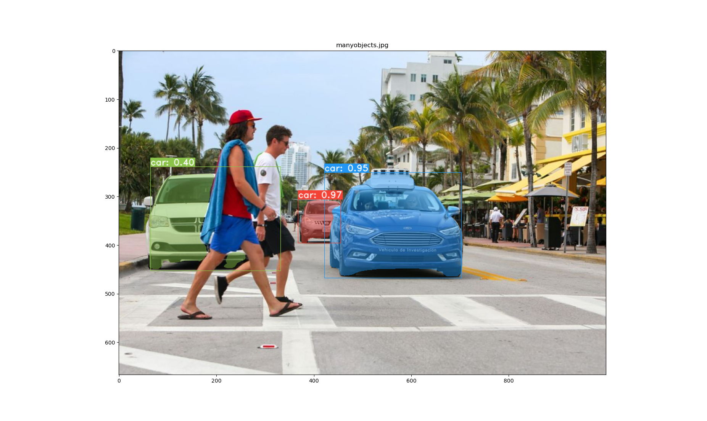

<<<<<<< HEAD

 This is the code for our papers: - [YOLACT: Real-time Instance Segmentation](https://arxiv.org/abs/1904.02689)


This repo will help you detect and segment the instances of the cars: 
Below you can see the results from this YOLACT model.




=======
# yolact

 This is the code from the papers: - [YOLACT: Real-time Instance Segmentation](https://arxiv.org/abs/1904.02689)
 
 I have used and updated the code from https://github.com/dbolya/yolact.git


This repo will help you detect and segment the instances of the cars: 
Below you can see the results from this YOLACT model. This repo supports FPN.

Here we tried to detect and genarate a mask for all the cars in an image.

As asked in the task:
Only the highest score car is detected and a mask is genrated over the car:


In this case I have Visualize all the cars:

>>>>>>> 69739a4d34d019f0c60c9ff465f55a7574cce73f

# Installation
 - Clone this repository and enter it:
   ```Shell
   git clone https://github.com/Priyashbhugra/yolact.git
   cd yolact
   ```
 - Create Anaconda environment:
<<<<<<< HEAD
   ```Shell
   conda create -n yolact 
  
      ```

 - Run the below command and wait untill the envionment is created:
   ```Shell
=======
   ```Shell
   conda create -n yolact
   conda activate yolact
  
      ```
 - Run the below command and wait untill the envionment is created:
   ```Shell
>>>>>>> 69739a4d34d019f0c60c9ff465f55a7574cce73f
   conda env create -f environment.yml`
   ```


# Evaluation
<<<<<<< HEAD
Here are our YOLACT models pretrained on COCO dataset:
=======
Here is a YOLACT model pretrained on COCO dataset:
>>>>>>> 69739a4d34d019f0c60c9ff465f55a7574cce73f

- Download Resnet101-FPN ----------[yolact_im700_54_800000.pth](https://drive.google.com/file/d/1lE4Lz5p25teiXV-6HdTiOJSnS7u7GBzg/view?usp=sharing)

I am only using Resnet101-FPN as a backbone.
To evalute the model, put the corresponding weights file in the `weights` directory and run one of the following commands.

## Results on pretrained COCO dataset
- Run the below command for evaluation
```Shell
<<<<<<< HEAD
python eval.py --trained_model=weights/yolact_im700_54_800000.pth --score_threshold=0.15 --image=car.jpeg --cross_class_nms=True
=======
python eval.py --trained_model=weights/yolact_im700_54_800000.pth --score_threshold=0.15 --image=car.jpeg --cross_class_nms=True --top_k=1 
>>>>>>> 69739a4d34d019f0c60c9ff465f55a7574cce73f
```
